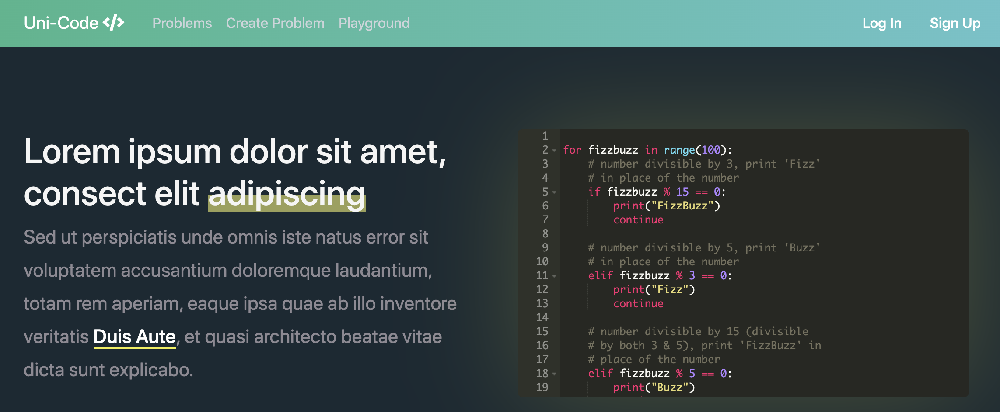

**Uni-Code** was a web app where students could solve data structures & algorithms problems. I lead a team of four to build this project for my Senior year Software Engineering course.
Along with creating the database schema and writing design docs, I was responsible for writing the module that handled problem creation, submission, and querying,
as well as writing the user accounts module. My favorite feature I implemented was a reddit-like upvote feature for the problem browsing page. 

- Implemented with `Python` `Django` `jQuery` `Bootstrap` `sqlite3` 
 
