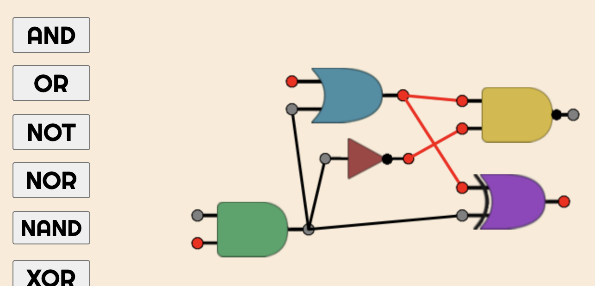

**Boolean Playground** is a logic gate simulation web app where you can build custom circuits. 
It supports both combinational logic as well as sequential logic, making Boolean Playground _technically_ Turing-complete.
Thus far, the most complicated cirtuit I've made is a 4-bit adder, constructing more complicated circuits quickly becomes infeasible with the app's current constraints.

- Implemented with `Javascript` `CSS` `HTML Canvas` 
 
