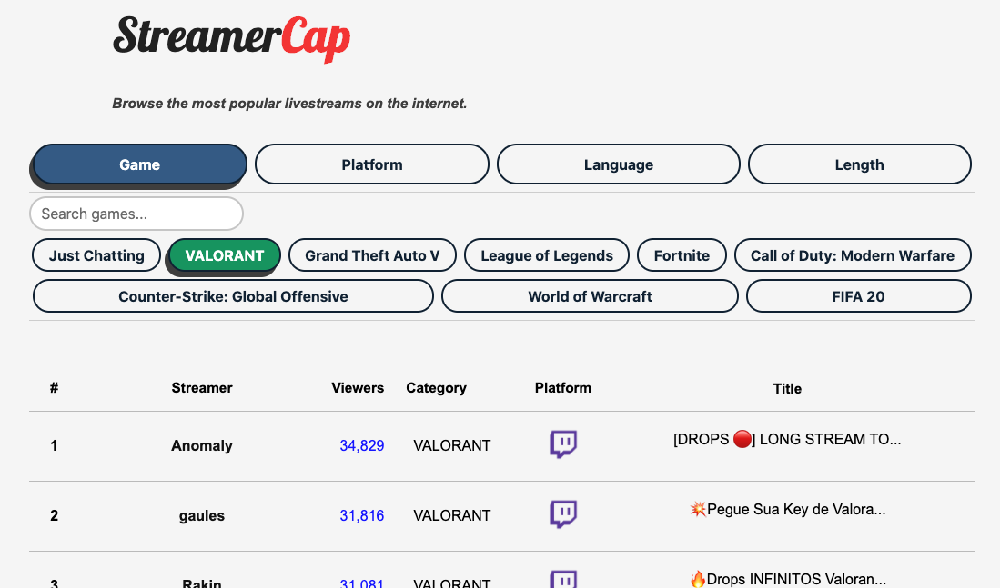

**StreamerCap** is my current side project. It's a web app that aggregates live video game streams across different sites to sort and filter by various criteria. Implemented using Python’s `Django`, `JS`, `HTML`, `CSS`, `Postgresql`, & `AWS`. I found that Twitch.tv's filtering tool to find new streams was not as feature rich as I would like. 
For example, Twitch doesn't allow you to filter multiple games at a time, or do other additive filters. On Twitch it's impossible to display all streamers who are playing either League of Legends or Starcraft 2, speak either English or Korean, and who have been streaming for over 5 hours. Those filter parameters are possible on StreamerCap, with the addition of supporting Mixer(Twitch competitor) as well.
 
